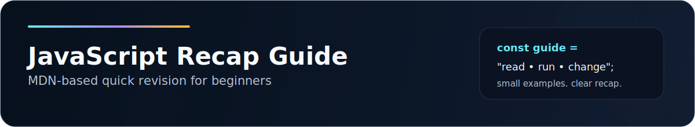

	

A minimal, MDN-based recap for learning JavaScript fast.

> Read. Run. Change. Repeat.

## Quick view

| Focus | Details |
| --- | --- |
| Best for | Beginners and quick revision |
| Style | Short notes, small examples, repeated practice |
| Full guide | [javascript-learning-guide.md](javascript-learning-guide.md) |

## What you will learn

- Basics and syntax
- Variables and data types
- Operators and comparison
- Strings, numbers, arrays, and dates
- Control flow, functions, objects, and scope
- DOM, events, async JavaScript, and modules

## Practice files

| File | Topic |
| --- | --- |
| [Hello.js](Hello.js) | Basics and variables |
| [datatype.js](datatype.js) | Data types and Boolean conversion |
| [comparison.js](comparison.js) | Equality and strict equality |
| [operation.js](operation.js) | Operators and increment behavior |
| [string.js](string.js) | String methods |
| [name_and_math.js](name_and_math.js) | Number and Math |
| [myarrays.js](myarrays.js) | Arrays |
| [Dates.js](Dates.js) | Dates and formatting |

## How to use

1. Open [javascript-learning-guide.md](javascript-learning-guide.md).
2. Run one practice file.
3. Change one line and run it again.
4. Move to the next topic when the current one feels clear.

## Core rules

- Use `const` by default.
- Use `let` when values change.
- Avoid `var`.
- Prefer `===` over `==`.

## Tiny project checklist

- [ ] Calculator
- [ ] Number guessing game
- [ ] Todo list

## Companion guide

The full step-by-step guide lives in [javascript-learning-guide.md](javascript-learning-guide.md).